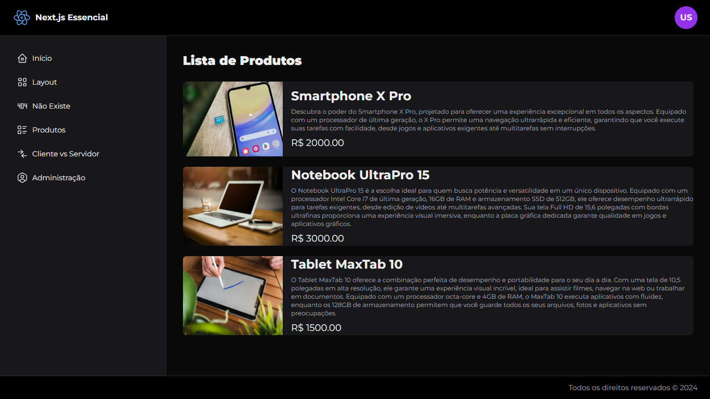

# **Projeto Next.js**

## **Esse projeto é como um playground onde eu brinco com o Next.js, React e Tailwind CSS. Experimentei várias coisas legais, como:**

* **Páginas dinâmicas:** Criei páginas para produtos, administração e até uma página de erro 404 bem divertida.
* **Componentes reutilizáveis:** Desenvolvi componentes personalizados para deixar a interface mais bonita e organizada.
* **Estilos com Tailwind CSS:** Deixei tudo com a cara que eu queria usando as classes utilitárias do Tailwind.
* **Dados fakes:** Criei alguns dados de produtos para simular um e-commerce.

## **Como funciona:**

1. **Página inicial:** A página principal te dá as boas-vindas e é o ponto de partida para explorar o projeto.
2. **Produtos:** Nessa seção, você encontra uma lista de produtos fictícios com fotos e descrições.
3. **Administração:** Essa área é só para administradores (por enquanto sou eu mesmo!).
4. **Página 404:** Se você tentar acessar uma página que não existe, você vai encontrar um explorador perdido e perdido. 

## **Tecnologias usadas:**

* **Next.js:** O framework que torna tudo isso possível.
* **React:** A biblioteca para criar interfaces de usuário.
* **Tailwind CSS:** Para estilizar tudo de forma rápida e fácil.

## **Para Executar:**

Para iniciar a aplicação localmente, certifique-se de ter o Node.js e o npm instalados. Siga estas etapas:

1. Clone o repositório para sua máquina local.
2. Abra um terminal ou prompt de comando e navegue até a pasta do projeto.
3. Execute `npx create-next-app@latest` para instalar as dependências necessárias.
4. Execute `npm i @tabler/icons-react` para instalar os icones Tabler para React.
5. Execute `npm i react-loading-skeleton` para instalar o loading skeleton.
6. Execute `npm run dev` para iniciar o servidor de desenvolvimento.
7. Acesse `http://localhost:3000` (ou a porta especificada no script `dev` do `package.json`) em seu navegador para ver a aplicação em funcionamento.

### **Quer mexer no código?**

Sinta-se à vontade para clonar o repositório e explorar o código. Se tiver alguma dúvida, pode abrir uma issue. 
